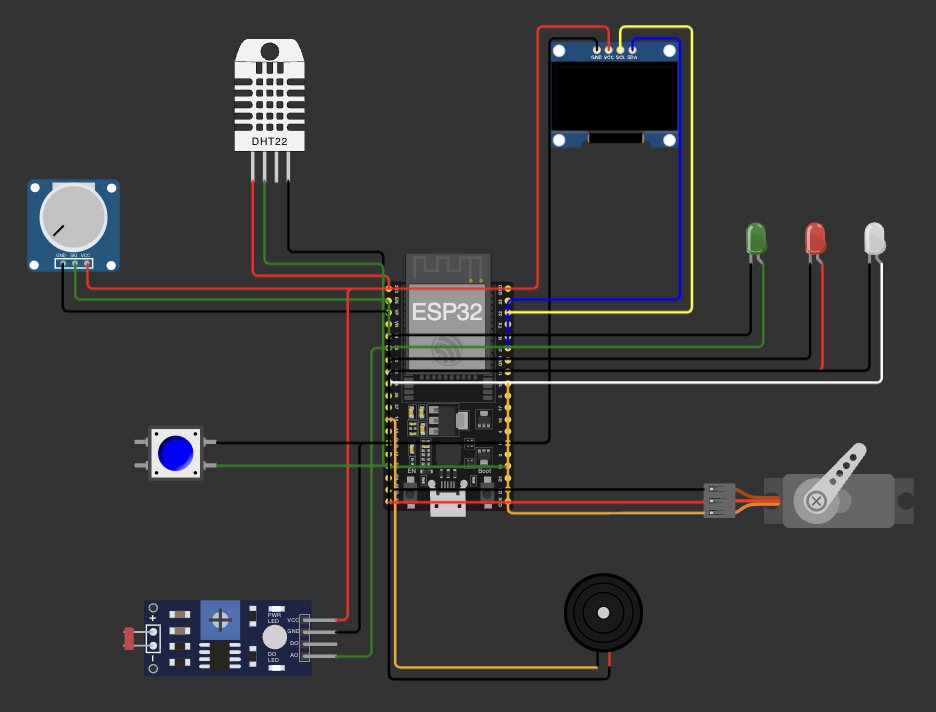
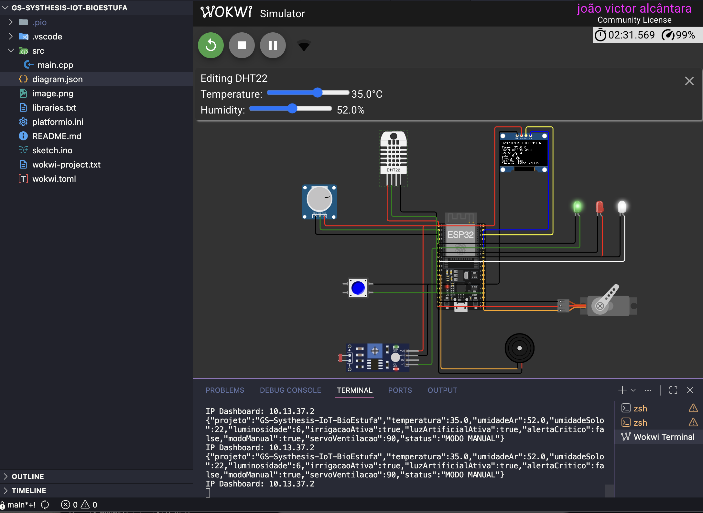
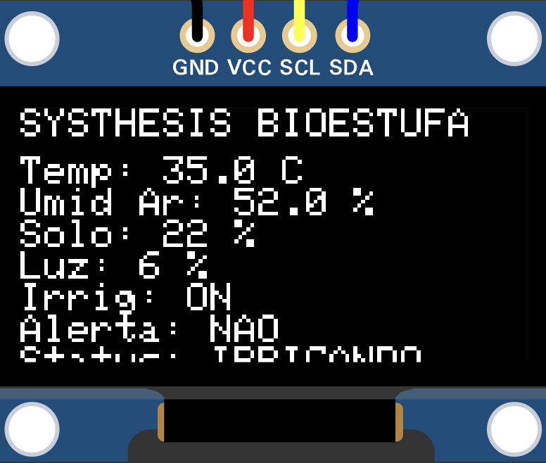
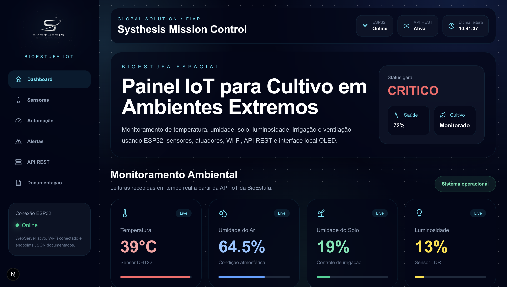
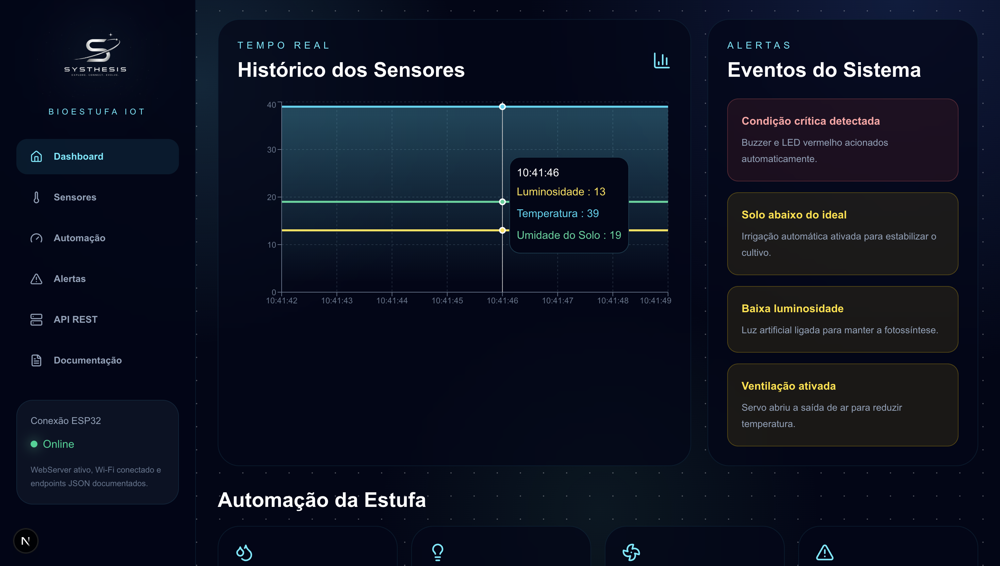
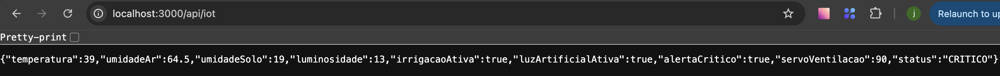
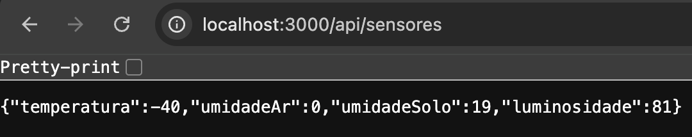
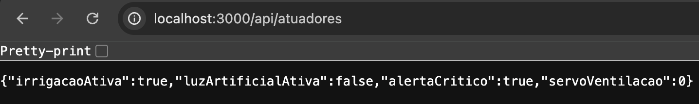
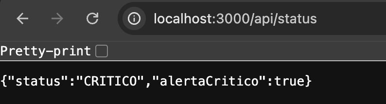

# 🌱 Systhesis BioEstufa Espacial IoT

## 👨‍💻 Integrantes

* João Victor Alcântara — RM562707
* Phillipo Barbosa — RM565399
* Eduardo Martins — RM562259

---

# 📌 Descrição do Projeto

A Systhesis BioEstufa Espacial é um protótipo IoT desenvolvido para monitoramento e automação de uma bioestufa inteligente destinada à produção de alimentos em colônias espaciais.

O sistema utiliza sensores conectados a um ESP32 para coletar dados ambientais em tempo real e acionar atuadores automaticamente, garantindo condições adequadas para o cultivo em ambientes extremos.

---

# 🌎 Problema

A produção de alimentos em ambientes extraterrestres representa um dos principais desafios para futuras missões espaciais.

Fatores como temperatura, umidade, luminosidade e disponibilidade de água precisam ser monitorados constantemente para garantir a sobrevivência das plantações.

---

# ✅ Solução

O sistema monitora continuamente as condições da bioestufa e executa ações automáticas quando necessário.

### Funcionalidades

* Monitoramento de temperatura
* Monitoramento da umidade do ar
* Monitoramento da umidade do solo
* Monitoramento da luminosidade
* Irrigação automática
* Controle de iluminação artificial
* Controle de ventilação
* Alertas críticos
* Dashboard em tempo real
* API REST para integração dos dados

---

# 🏗️ Arquitetura da Solução

```text
Sensores
   ↓
ESP32
   ↓
API REST Next.js
   ↓
Dashboard Web
```

Fluxo de dados:

1. Sensores enviam informações ao ESP32.
2. O ESP32 processa os dados.
3. Os dados são enviados via Wi-Fi para a API REST.
4. O Dashboard consome os dados da API.
5. As informações são exibidas em tempo real.

---

# 🛠️ Tecnologias Utilizadas

### Hardware

* ESP32
* DHT22
* Sensor de Umidade do Solo
* Sensor LDR
* OLED SSD1306
* Servo Motor
* LEDs
* Buzzer

### Software

* Arduino Framework
* PlatformIO
* Wokwi
* Next.js
* TypeScript
* API REST
* Vercel

---

# 🌡️ Sensores

## DHT22

Responsável por:

* Temperatura
* Umidade do ar

## Sensor de Umidade do Solo

Responsável por:

* Controle da irrigação

## Sensor LDR

Responsável por:

* Controle de luminosidade

---

# ⚙️ Atuadores

## Servo Motor

Controle da ventilação.

## LED de Irrigação

Indica quando a irrigação está ativa.

## LED de Luz Artificial

Indica quando a iluminação complementar está ativa.

## LED de Alerta

Indica situações críticas.

## Buzzer

Emite alertas sonoros em situações críticas.

## Display OLED

Exibe informações do sistema localmente.

---

# 🌐 API REST

A API REST recebe dados enviados pelo ESP32 e disponibiliza informações para o Dashboard.

### Endpoint Principal

```http
POST /api/iot
```

Recebe os dados enviados pelo ESP32.

```http
GET /api/iot
```

Retorna todos os dados da BioEstufa.

---

# 📡 Endpoints JSON

## GET /api/iot

Retorna todos os dados do sistema.

## GET /api/sensores

Retorna:

* temperatura
* umidadeAr
* umidadeSolo
* luminosidade

## GET /api/status

Retorna:

* status
* alertaCritico

## GET /api/atuadores

Retorna:

* irrigacaoAtiva
* luzArtificialAtiva
* alertaCritico
* servoVentilacao

---

# 📄 Exemplo de Resposta

```json
{
  "temperatura": 28.5,
  "umidadeAr": 45,
  "umidadeSolo": 62,
  "luminosidade": 40,
  "irrigacaoAtiva": true,
  "luzArtificialAtiva": false,
  "alertaCritico": false,
  "servoVentilacao": 90,
  "status": "NORMAL"
}
```

---

# 📁 Estrutura do Projeto

```text
src/
 └── main.cpp

platformio.ini
diagram.json
wokwi.toml
```

---

# ▶️ Como Executar

## 1. Simulação no Wokwi

Importar os arquivos:

* diagram.json
* wokwi.toml
* src/main.cpp

## 2. Executar a Simulação

Iniciar o projeto no Wokwi.

## 3. Testar Sensores

Alterar os valores dos sensores para observar:

* Irrigação automática
* Ventilação automática
* Luz artificial
* Alertas críticos

## 4. Dashboard

Executar:

```bash
npm install
npm run dev
```

---

# 📷 Evidências

## Circuito ESP32



## Simulação Wokwi



## Display OLED



## Dashboard





## Endpoints

* /api/iot



* /api/sensores



* /api/atuadores



* api/status



---

# 🔗 Links

## Dashboard

https://gs-systhesis-io-t-dashboard.vercel.app/

## Repositório Dashboard

https://github.com/alc-joao/GS-Systhesis-IoT-Dashboard

## Repositório IoT

https://github.com/alc-joao/GS-Systhesis-IoT-BioEstufa

---

# 🎥 Vídeo Pitch

Adicionar link do vídeo de apresentação.

---

# 🌱 Systhesis BioEstufa Espacial

Projeto acadêmico desenvolvido para a Global Solution FIAP 2026.
